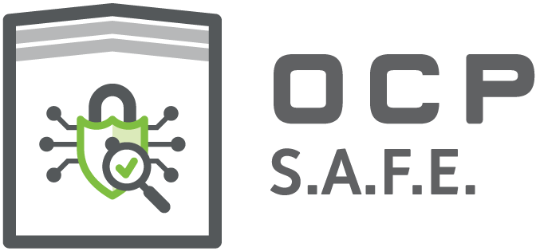

# Security Appraisal Framework and Enablement

OCP Security Workgroup

**Revision History**

<table>
  <tr>
   <td><strong>Revision</strong>
   </td>
   <td><strong>Date</strong>
   </td>
   <td><strong>Guiding Contributor(s)</strong>
   </td>
   <td><strong>Description</strong>
   </td>
  </tr>
  <tr>
   <td>0.1
   </td>
   <td>Ma, 2021
   </td>
   <td>Andres Lagar-Cavilla, Bryan Kelly, Gunter Ollman, Vidya Satyamsetti, Aditya Shantanu, Nikita Abdullin, Alex Eisner, Chris Ertl, Nicolas Ruff
   </td>
   <td>Initial draft
   </td>
  </tr>
  <tr>
   <td>0.2
   </td>
   <td>April, 2023
   </td>
   <td>Eric Eilertson, Thordur Bjornsson, Balaji Vembu
   </td>
   <td>Update draft
   </td>
  </tr>
  <tr>
   <td>0.3
   </td>
   <td>May, 2023
   </td>
   <td>Jeremy Boone 
   </td>
   <td>Update draft
   </td>
  </tr>
  <tr>
   <td>1.0
   </td>
   <td>Sept, 2023
   </td>
   <td>Eric Eilertson
   </td>
   <td>Publish release framework
   </td>
  </tr>
  <tr>
   <td>1.1
   </td>
   <td>October, 2024
   </td>
   <td>Rob Wood
   </td>
   <td>Add manifest support
   </td>
  </tr>
  <tr>
   <td>1.2
   </td>
   <td>August, 2025
   </td>
   <td>Rob Wood
   </td>
   <td>Clarify publication process
   </td>
  </tr>
</table>

# Glossary

* CSP - Cloud Service Provider
* DV - Device Vendor
* SRP - Security Review Provider
* TAC - Technical Advisory Committee

# Executive Summary         

Today’s modern data centers are comprised of a wide variety of processing devices (CPU, GPU, FPGA, etc.) and peripheral
components (network controllers, accelerators, storage devices, etc.). These devices typically run updatable software,
firmware, or microcode which can reside internally or externally to the device. The provenance, code quality, and
software supply chain for firmware releases and patches that run on these devices requires a strong degree of security
assurance.

Ideally, none of the security- or privacy-critical components are designed in a way that requires a data center provider
and their customers to place trust in a single entity. To work towards this goal, many data center providers have been
engaging third-parties to conduct security audits of device supplier firmware. The objective of these audits is to
provide
data center providers and end users with independent assurances about the component providers security posture.

In this document, we describe the role of a trusted third-party (or multiple parties) to independently review the device
manufacturer's architecture, ROM, and firmware on behalf of data center providers. This framework enables device and
system manufacturers to achieve a security review that can be accepted by multiple customers through a single shared
process. Cloud providers and security conscious data center operators can avoid duplication of their security evaluation
processes, and increase the pace at which they receive, trust, and deploy critical firmware updates for their
infrastructure and services.

# Firmware Security Review Framework

This framework describes the process by which a Device Vendor can engage a Security Review Provider to undertake a
security assessment of a given device and all subsequent firmware releases pertaining to that device. This document
defines several expectations for a security audit, including the intended scope of testing and the reporting
deliverables.

Compared to other industry processes, (e.g., Common Criteria, FIPS, or PCI-DSS) that focus on compliance to exact
criteria, the intention of this framework is to provide lightweight review areas to guide security audits. These audits
will be almost exclusively performed by manual code inspection by subject-matter-experts (the SRP) and are expected to
provide not only details on specific vulnerability findings, but also analysis and critique of threat models, designs,
and overall security posture of the device compared to industry standards (
e.g. [NIST 800-193](https://nvlpubs.nist.gov/nistpubs/SpecialPublications/NIST.SP.800-193.pdf), [Secure Hardware Design Guidelines](https://opentitan.org/book/doc/security/implementation_guidelines/hardware/), [TCG Guidance for Secure Update of Software and Firmware on Embedded Systems](https://trustedcomputinggroup.org/wp-content/uploads/TCG-Secure-Update-of-SW-and-FW-on-Devices-v1r72_pub.pdf), [OCP's Secure Firmware Development Best Practices](https://www.opencompute.org/documents/csis-firmware-security-best-practices-position-paper-version-1-0-pdf)).

The conditions under which these reviews take place, are of two main types:

* **DV Initiated:** Proactively initiated by a DV, before releasing a new device, or after updates have been made to an
  existing device’s firmware.
* **Customer Initiated:** When a DV customer, such as a CSP, requests a security review be performed under this
  framework.

At a high level, the process flows through the following sequence of steps:

1. DV selects an SRP from the list of [approved providers](./security_review_providers.md).
2. DV and SRP prepare a scope for the security review according to the [Security Review Scope](#security-review-scope) information provided below and in the supplementary [review areas](./review_areas.md).
3. SRP performs the security review.
4. DV addresses any findings from the SRP.
5. SRP reviews the changes and issues the final reports.
6. DV and SRP prepare the necessary deliverables.
7. The DV provides them to the [OCP Security WG](https://www.opencompute.org/wiki/Security) for publication in the form of a GitHub Pull Request (see [OCP Report Deliverables](#ocp-report-deliverables) below).

Device Vendors are encouraged to engage an SRP early in the architectural definition process and continue with reviews
at major architectural or implementation milestones, e.g. 0.8 of architectural and implementation specifications, and
when ROM or firmware codes are nearing completion. This will help the device vendor avoid costly code rewrites or chip
re-spins to address critical vulnerabilities. The results of these engagements during product development need not be
published, only assessments of released products is within scope of the OCP S.A.F.E. program.

## Objectives

The key objectives of this framework are:

* Provide security conformance assurance to all device consumers.
* Reduce overhead and duplication of effort by providing a clearing house for independent security reviews.
* Decrease competitive objections that prevent source code sharing for the purpose of robust independent security
  testing and the dissemination of findings and reports.
* Increase the number of devices whose firmware and associated updates are reviewed on a continuous basis.
* Through iterative refinement of review areas, testing scopes, and reporting requirements, progressively advance the
  security posture of hardware and firmware components across the supply chain.

## Security Review Provider Selection

The reputation and integrity of the Security Review Providers are as important as their technical expertise. If there is
a belief that the SRP delivers work of variable quality this brings into question all the reports they produce.
Similarly, a conflict of interest degrades the value of the reports and in turn decreases the value of the SAFE
program.

The [SRP requirements document](./srp_requirements.md) contains requirements for the SRPs business, management, and
technical requirements. These requirements will be
evaluated in totality by the OCP SAFE Technical Advisory Committee (TAC).

The sample reports carry the most weight when evaluating an SRP. The reports demonstrate their ability to identify
vulnerabilities and justify why a vulnerability likely does not exist. Documenting the lack of a vulnerability will
require significantly more work than showing one exists. Additionally, a good report will describe areas for improvement
in the code or architecture of the device.

Successful SRPs will demonstrate thought leadership in the security and vulnerability finding community. This can be
done through papers, presentations, blog posts, videos etc. In addition to educating the security industry, successful
SRPs will have a history of publishing and maintaining the tools they use.

A newly approved SRP will be given a one-year probationary period to demonstrate their ability to produce quality
reports. If approved by the TAC, subsequent endorsements will be for 1-3 years. Continued endorsement is not automatic,
an SRP must be nominated and approved by the TAC.

### Disqualification

SRPs may have their endorsement suspended or revoked at any time for issues that cause SAFE to question the SRPs
security practices, commitment to quality, or allegiances. Examples of such issues include losing control of a private
signing key or overlooking hard-coded credentials in firmware. Beyond egregious technical mistakes, an SRP must not be
controlled by a company it is auditing or affiliated with a firm that sells vulnerabilities or exploits.

## Security Review Scope

The following sections describe at a high level the areas that should be in scope for any security audit performed under
this framework.
They are intended as starting points for DVs and SRPs when undertaking a device or firmware security assessment. Under
the framework, it is required for every production version of device firmware to have undergone the assessment. A more
detailed
description of the scopes is provided in the [review areas](./review_areas.md) document.

* **Threat Model** \
  The SRP should assess the DV’s documented threat models and perform a gap analysis, ensuring they are adequately
  covered by the observed hardware and firmware implementation. If the DV cannot provide a threat model, then the SRP
  should create one as part of the assessment scope. The threat model document should include the following details, and
  be aligned with the in-scope and out-of-scope threats described by
  the [Common Security Threats](https://www.opencompute.org/documents/common-security-threats-notes-1-pdf)
  document:
    * **Security Objectives**: The high-level security objectives or key
      risks exposed by the firmware. Examples of such objectives may include the strict requirement that the secure boot
      or firmware anti-rollback features must not be subverted or bypassed by an attacker.
    * **Adversarial Model**: A listing of all threat actors along with their
      motivation and capabilities. Examples may include a simple opportunistic hardware adversary, or advanced
      persistent threats that are able to keep the device under antagonistic conditions for an extended duration.
    * **Attack Surface Enumeration**: A listing of all remote, local and
      physical attack surfaces exposed by the device. Examples may include mailbox or IPC interfaces exposed via MMIO, a
      command shell exposed via a serial interface, inter-chip buses which transmit sensitive data, or external
      non-volatile storage media.
    * **Critical Assets**: A listing of all security-impacting assets within
      the firmware, and the corresponding Confidentiality, Integrity and Availability requirements for each. Examples of
      critical assets may include secret keys, the fuse configuration, or any configuration data residing in external flash.

The SAFE program defines 3 security review scopes. These scopes increase the complexity of attacks in the threat model.
It is expected that devices will have reviews done with different review scopes. For example, a CPU may have a scope 3
review of the root of trust due to the need for glitch protection when using a long-term device private key. This CPU
may use a scope 2 review for the application cores.

* **Scope 1 Code and Architecture Assessment**
    * **Source Code Review** \
      The SRP should perform a whitebox security review of the device’s ROM and mutable firmware source code for
      identification of vulnerabilities and lapses in industry best practices. Issues uncovered during the review should
      be fixed by the DV and subsequently verified as fixed by the SRP. The review scope should include:
        * Analysis of the firmware loading and verification procedures to ensure that a secure boot implementation is
          present and cannot be circumvented. All critical assets that impact the device’s security must be
          cryptographically signed. The
          OCP [Secure Boot](https://www.opencompute.org/documents/secure-boot-2-pdf)
          document should be used for guidance.
        * Discovery of hard-coded credentials, seeds, private keys, or symmetric secrets.
        * Identifying temporal and spatial memory safety issues that arise due to improper input validation or race
          conditions that may occur along the attack surfaces that were identified in the threat model.
        * Discovery of remnant debug handlers on production builds
        * Analysis of the cryptographic constructions employed by the firmware when protecting the confidentiality or
          integrity of any critical assets.
        * Improper handling of cryptographic material, e.g. keys, counters, nonces, seeds.
        * Trust-boundary violations between privilege levels or across components, such as confused deputy problems or
          insufficient privilege separation between a firmware’s user and supervisor modes.
        * Identify outdated third-party libraries which are associated with publicly known CVEs.
        * Evaluation of exploit mitigation technologies such as: Address space randomization, stack canaries, data
          execution prevention, NULL page mapping, guard pages, and so on.
    * **Sensitive Functionality Review** \
      The SRP should review the firmware source code and should describe the presence and scope of all
      security-sensitive or commonly “restricted” functionality. This review can be used by consumers to measure risk
      and to configure deployment or isolation controls. The review scope should include:
        * TCG DICE implementation.
        * SPDM implementation.
        * Remote firmware update, manageability, or command and control functionality.
        * Manufacturing, debug, diagnostics, testing and logging capabilities.
        * Unauthenticated APIs.
        * Safe generation and handling of all cryptographic material.
        * Encryption capability controls (disk encryption, erase, rotation).
        * Secure boot key rotation capabilities.
* **Scope 2 - Focusing on Trust boundaries**
    * Trusted execution environment assessment
    * Handling of trust boundaries
    * Attestation and non-repudiation across boundaries
    * Authenticated and encrypted IO, e.g., PCIe-IDE, TDISP, or vendor proprietary
* **Scope 3 - Resilience to physical attacks**
    * Critical components and operations are designed to securely handle glitch attacks in a documented way
    * Crypto blocks are designed to be resistant to side channel analysis.

## OCP Report Deliverables

This framework stipulates that the following be delivered to the OCP SAFE program for publication in the appropriate
public [GitHub](https://github.com/opencomputeproject/OCP-Security-SAFE) repositories after the review (and remediation and re-testing)
has concluded:

* **Scope Document** \
  DV and SRP should jointly negotiate the scope of the review, based on the
  [review areas](#security-review-scope). As alluded to above, the areas are neither exhaustive nor complete, therefore
  the DV is encouraged to socialize the Scope with the OCP Security WG, either through its regular calls, or on its
  mailing list. The scope itself can be any number of documents, as long as the concatenation of them is provided to the OCP Security
  WG. Aside from level of effort estimates, no part of the DV/SRP statement of work, NDAs, etc. needs to be published.
* **Short-Form Report** \
  The SRP must produce a cryptographically signed machine-readable short-form report. Only the final results are to be
  in the signed SFR (after remediation and retesting). This document will summarize the audit scope, and uniquely identify
  the vendor, device and firmware version by means of a firmware hash. This report will enumerate all vulnerabilities
  with a CVSS score and a brief summary. The short-form report specification can be found in
  [Appendix B](#appendix-b-machine-readable-short-form-report-format). To claim OCP SAFE endorsement for a
  product-firmware combination this report must be published to the OCP GitHub repository. This signed SFR is delivered
  to the DV for publication.
* **GitHub Pull Request Submission**\
  The Pull Request (PR) for the submission to GitHub *must* be from the Device Vendor. This ensures that the DV is in
  control of timing and messaging around any potential unfixed vulnerability disclosures. Previous versions of this document allowed
  for the SRP to publish the PR on behalf of the DV, however this created ambiguity and allowed the possibility that an
  SRP might publish an SFR without the DV's blessing. The DV, at their discretion, may elect to delay the publication, or not to publish at all and
  forgo OCP SAFE endorsement.
* **Signed Git Commits**\
  The OCP GitHub repository is configured to require all commits to be [signed](https://docs.github.com/en/authentication/managing-commit-signature-verification/signing-commits). Please remember this when preparing the submission (use [--amend --signoff](https://stackoverflow.com/a/15667644) if you forget).
* **SRF Pull Request Path**\
  The location of the signed SFRs should be in Reports/$Vendor/$Year/$Product. As a convenience,
  the submission may choose to additionally include the human-readable SFR documents.
* **SRP Public Key Pull Request Path**\
  The location of the signing public key should be in SRP_certificates/$SRP. These are to be published and maintained by
  the SRP, and may be revoked by the TAC (see [Disqualification](#Disqualification) above).

In addition to the short-form report, the SRP should deliver to the DV a detailed report. This report will likely be
protected by NDA and will not be published. The DV should address the findings in the report. The DV is encouraged to
use the findings in the report to improve design, engineering, build, and test processes.

* **Report Document** \
  The SRP should compile a report that addresses the full scope, and threat model; It may be in the SRPs/DVs preferred
  format, including branding. It should include the following sections:
    * An executive summary that summarizes the following:
        * Review scope
        * Effort (person-days)
        * Test methodology (e.g., source code access, onsite vs. remote testing)
        * Limitations (e.g., blockers, areas of incomplete test coverage, etc.)
        * Strategic recommendations
    * Detailed descriptions of vulnerabilities or findings, if any. For each finding, the following information should
      be included:
        * An estimate of the overall risk, impact and exploitability.
        * The CVSS score and vector.
        * The CWE enumeration.
        * Mitigations, or recommended remediations, if any.
        * Reproduction steps, if any.
    * Analysis and critique section for the relevant review areas, and of the threat model and scope

Several SRP sample reports can be found in [Appendix A](#appendix-a-example-reports).

# Appendix A: Example Reports

* Atredis Partners - [Sample Deliverables](https://www.atredis.com/sample-deliverables)
* NCC
  Group - [Zephyr RTOS Security Assessment](https://www.nccgroup.com/media/n0ahjxum/_ncc_group_zephyr_mcuboot_research_report_2020-05-26_v10.pdf)
  and other [public reports](https://www.nccgroup.com/us/research-blog/?category=18157#hub)
* NCC's first review of [Caliptra](https://chipsalliance.github.io/Caliptra/) can be
  found [here](https://github.com/chipsalliance/Caliptra/blob/main/doc/NCC_Group_Microsoft_MSFT283_Report_2023-10-13_v1.2.pdf)

# Appendix B: Machine Readable Short-Form Report Format

A reference implementation of the library to produce and verify short form reports is available
in [this repo](https://github.com/opencomputeproject/OCP-Security-SAFE).
