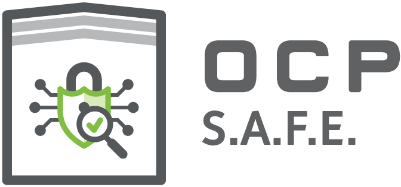

# Security Appraisal Framework and Enablement

OCP Security Workgroup

**Revision History**

<table>
  <tr>
   <td><strong>Revision</strong>
   </td>
   <td><strong>Date</strong>
   </td>
   <td><strong>Guiding Contributor(s)</strong>
   </td>
   <td><strong>Description</strong>
   </td>
  </tr>
  <tr>
   <td>0.1
   </td>
   <td>Ma, 2021
   </td>
   <td>Andres Lagar-Cavilla, Bryan Kelly, Gunter Ollman, Vidya Satyamsetti, Aditya Shantanu, Nikita Abdullin, Alex Eisner, Chris Ertl, Nicolas Ruff
   </td>
   <td>Initial draft
   </td>
  </tr>
  <tr>
   <td>0.2
   </td>
   <td>April, 2023
   </td>
   <td>Eric Eilertson, Thordur Bjornsson, Balaji Vembu
   </td>
   <td>Update draft
   </td>
  </tr>
  <tr>
   <td>0.3
   </td>
   <td>May, 2023
   </td>
   <td>Jeremy Boone 
   </td>
   <td>Update draft
   </td>
  </tr>
  <tr>
   <td>1.0
   </td>
   <td>Sept, 2023
   </td>
   <td>Eric Eilertson
   </td>
   <td>Publish release framework
   </td>
  </tr>
  <tr>
   <td>1.1
   </td>
   <td>October, 2024
   </td>
   <td>Rob Wood
   </td>
   <td>Add manifest support
   </td>
  </tr>
  <tr>
   <td>1.2
   </td>
   <td>August, 2025
   </td>
   <td>Rob Wood
   </td>
   <td>Clarify publication process
   </td>
  </tr>
  <tr>
   <td>2.0
   </td>
   <td>March, 2026
   </td>
   <td>Alex Tzonkov
   </td>
   <td>Added CoRIM SFR support
   </td>
  </tr>
  <tr>
   <td>2.1
   </td>
   <td>June, 2026
   </td>
   <td>Nick Hummel
   </td>
   <td>Added AI review requirement
   </td>
  </tr>
</table>

# Glossary

* CSP - Cloud Service Provider
* DV - Device Vendor
* SRP - Security Review Provider
* TAC - Technical Advisory Committee

# Executive Summary         

Today’s modern data centers are comprised of a wide variety of processing devices (CPU, GPU, FPGA, etc.) and peripheral
components (network controllers, accelerators, storage devices, etc.). These devices typically run updatable software,
firmware, or microcode which can reside internally or externally to the device. The provenance, code quality, and
software supply chain for firmware releases and patches that run on these devices requires a strong degree of security
assurance.

Ideally, none of the security- or privacy-critical components are designed in a way that requires a data center provider
and their customers to place trust in a single entity. To work towards this goal, many data center providers have been
engaging third-parties to conduct security audits of device supplier firmware. The objective of these audits is to
provide
data center providers and end users with independent assurances about the component providers security posture.

In this document, we describe the role of a trusted third-party (or multiple parties) to independently review the device
manufacturer's architecture, ROM, and firmware on behalf of data center providers. This framework enables device and
system manufacturers to achieve a security review that can be accepted by multiple customers through a single shared
process. Cloud providers and security conscious data center operators can avoid duplication of their security evaluation
processes, and increase the pace at which they receive, trust, and deploy critical firmware updates for their
infrastructure and services.

# Firmware Security Review Framework

This framework describes the process by which a Device Vendor can engage a Security Review Provider to undertake a
security assessment of a given device and all subsequent firmware releases pertaining to that device. This document
defines several expectations for a security audit, including the intended scope of testing and the reporting
deliverables.

Compared to other industry processes, (e.g., Common Criteria, FIPS, or PCI-DSS) that focus on compliance to exact
criteria, the intention of this framework is to provide lightweight review areas to guide security audits. These audits
will be almost exclusively performed by manual code inspection by subject-matter-experts (the SRP) and are expected to
provide not only details on specific vulnerability findings, but also analysis and critique of threat models, designs,
and overall security posture of the device compared to industry standards (
e.g. [NIST 800-193](https://nvlpubs.nist.gov/nistpubs/SpecialPublications/NIST.SP.800-193.pdf), [Secure Hardware Design Guidelines](https://opentitan.org/book/doc/security/implementation_guidelines/hardware/), [TCG Guidance for Secure Update of Software and Firmware on Embedded Systems](https://trustedcomputinggroup.org/wp-content/uploads/TCG-Secure-Update-of-SW-and-FW-on-Devices-v1r72_pub.pdf), [OCP's Secure Firmware Development Best Practices](https://www.opencompute.org/documents/csis-firmware-security-best-practices-position-paper-version-1-0-pdf)).

The conditions under which these reviews take place, are of two main types:

* **DV Initiated:** Proactively initiated by a DV, before releasing a new device, or after updates have been made to an
  existing device’s firmware.
* **Customer Initiated:** When a DV customer, such as a CSP, requests a security review be performed under this
  framework.

At a high level, the process flows through the following sequence of steps:

1. DV selects an SRP from the list of [approved providers](./security_review_providers.md).
2. DV and SRP prepare a scope specific to the security review according to the general [Review Scope](./review_scope.md).
3. SRP performs the security review.
4. DV addresses any findings from the SRP.
5. SRP reviews the changes and issues the final reports.
6. DV and SRP prepare the necessary deliverables.
7. The DV provides them to the [OCP Security WG](https://www.opencompute.org/wiki/Security) for publication in the form of a GitHub Pull Request (see [OCP Report Deliverables](#ocp-report-deliverables) below).

Device Vendors are encouraged to engage an SRP early in the architectural definition process and continue with reviews
at major architectural or implementation milestones, e.g. 0.8 of architectural and implementation specifications, and
when ROM or firmware codes are nearing completion. This will help the device vendor avoid costly code rewrites or chip
re-spins to address critical vulnerabilities. The results of these engagements during product development need not be
published, only assessments of released products is within scope of the OCP S.A.F.E. program.

## Objectives

The key objectives of this framework are:

* Provide security conformance assurance to all device consumers.
* Reduce overhead and duplication of effort by providing a clearing house for independent security reviews.
* Decrease competitive objections that prevent source code sharing for the purpose of robust independent security
  testing and the dissemination of findings and reports.
* Increase the number of devices whose firmware and associated updates are reviewed on a continuous basis.
* Through iterative refinement of review areas, testing scopes, and reporting requirements, progressively advance the
  security posture of hardware and firmware components across the supply chain.

## OCP Report Deliverables

This framework stipulates that the following be delivered to the OCP SAFE program for publication in the appropriate
public [GitHub](https://github.com/opencomputeproject/OCP-Security-SAFE) repositories after the review (and remediation and re-testing)
has concluded:

* **Scope Document** \
  DV and SRP should jointly negotiate the scope of the review, based on the general
  [Review Scope](./review_scope.md). As alluded to above, the areas are neither exhaustive nor complete, therefore
  the DV is encouraged to socialize the Scope with the OCP Security WG, either through its regular calls, or on its
  mailing list. The scope itself can be any number of documents, as long as the concatenation of them is provided to the OCP Security
  WG. Aside from level of assessment effort, no part of the DV/SRP statement of work, NDAs, etc. needs to be published.
* **Short-Form Report** \
  The SRP must produce a cryptographically signed machine-readable short-form report. Only the final results are to be
  in the signed SFR (after remediation and retesting). This document will summarize the audit scope, and uniquely identify
  the vendor, device and firmware version by means of a firmware hash. This report will include a list of all vulnerabilities
  with a non-zero CVSS, or JIL for Scope 3 hardware findings, along with the CVSS, CWE, CVE (if applicable), and a brief
  summary for each. The short-form report specification can be found
  [here](./corim_profile/ocp-safe-sfr-profile.cddl). To claim OCP SAFE endorsement for a
  product-firmware combination this report must be published to the OCP GitHub repository. This signed SFR is delivered
  to the DV for publication.
* **GitHub Pull Request Submission**\
  The Pull Request (PR) for the submission to GitHub *must* be from the Device Vendor. This ensures that the DV is in
  control of timing and messaging around any potential unfixed vulnerability disclosures. Previous versions of this document allowed
  for the SRP to publish the PR on behalf of the DV, however this created ambiguity and allowed the possibility that an
  SRP might publish an SFR without the DV's blessing. The DV, at their discretion, may elect to delay the publication, or not to publish at all and
  forgo OCP SAFE endorsement.
* **Signed Git Commits**\
  The OCP GitHub repository is configured to require all commits to include `Signed-off-by` using the `--signoff` argument. Please remember this when preparing the submission (use [--amend --signoff](https://stackoverflow.com/a/15667644) if you forget).
* **SFR Pull Request Path**\
  The signed SFRs are published to the location Reports/$Vendor/$Year/$Product. As a convenience,
  the submission may choose to additionally include the human-readable SFR documents.
* **SRP Public Key Pull Request Path**\
  The public signing key of each SRP is published to the location SRP_certificates/$SRP. These are to be published and maintained by
  the SRP, and may be revoked by the TAC (see [SRP Approval Process](./srp_approval_process.md)).

In addition to the short-form report, the SRP should deliver to the DV a detailed report. This report will likely be
protected by NDA and will not be published. The DV should address the findings in the report. The DV is encouraged to
use the findings in the report to improve design, engineering, build, and test processes.

* **Report Document** \
  The SRP should compile a report that addresses the full scope, and threat model; It may be in the SRPs/DVs preferred
  format, including branding. It should include the following sections:
    * An executive summary that summarizes the following:
        * Review scope
        * Effort (person-days)
        * Test methodology (e.g., source code access, onsite vs. remote testing)
        * Limitations (e.g., blockers, areas of incomplete test coverage, etc.)
        * Strategic recommendations
    * Detailed descriptions of vulnerabilities or findings, if any. For each finding, the following information should
      be included:
        * An estimate of the overall risk, impact and exploitability.
        * The CVSS score and vector.
        * The CWE enumeration.
        * Mitigations, or recommended remediations, if any.
        * Reproduction steps, if any.
    * Analysis and critique section for the relevant review areas, and of the threat model and scope

Several SRP sample reports can be found in [Appendix A](#appendix-a-example-reports).

### Short-Form Report Guidance

* **Issue detail level:** The SFR should describe risks for CSPs and encourage the DV to improve security. Include enough detail to explain impact, but avoid exploit-enabling specifics. Protect IP by omitting code identifiers (variable, module, or function names).
    * Example phrasing: “Integer overflow in secure boot could lead to arbitrary code execution in ROM”; “Insecure protection configuration allows loading unsigned code.”
    * Avoid: “external_parser.c:195 parse_xml(xml_string) has a stack overflow when xml_string exceeds 1024 bytes, leading to arbitrary code execution.”
* **Quantitative Risk Ratings:** The SFR uses CVSS for quantitative risk ratings. The CVSS score is the primary factor determining whether a finding should be included in the SFR. As such, any finding with a non-zero CVSS score **must** be included in the SFR if it is within the defined security review scope. Findings with a CVSS score of zero, by definition pose no risk to the CSP and must be excluded.
* **Configuration-dependent findings:** Findings may exist that depend on configuration.
    * If a finding depends on the CSPs deployment configuration and the secure configuration plus associated risks are clearly documented in DV-providedd integration guidelines, it should be excluded from the SFR. If integration guidelines are missing and insecure configurations are plausible, include the finding in the SFR.
    * If a finding depends on DV-provided configuration (such as factory fuse configuration) in a way that allows a configuration change to undermine the security of the target without altering the firmware hash recorded in the SFR, then the finding should be included in the SFR.

# Appendix A: Example Reports

* Atredis Partners - [Sample Deliverables](https://www.atredis.com/sample-deliverables)
* NCC
  Group - [Zephyr RTOS Security Assessment](https://www.nccgroup.com/media/n0ahjxum/_ncc_group_zephyr_mcuboot_research_report_2020-05-26_v10.pdf)
  and other [public reports](https://www.nccgroup.com/us/research-blog/?category=18157#hub)
* NCC's first review of [Caliptra](https://chipsalliance.github.io/Caliptra/) can be
  found [here](https://github.com/chipsalliance/Caliptra/blob/main/doc/NCC_Group_Microsoft_MSFT283_Report_2023-10-13_v1.2.pdf)
