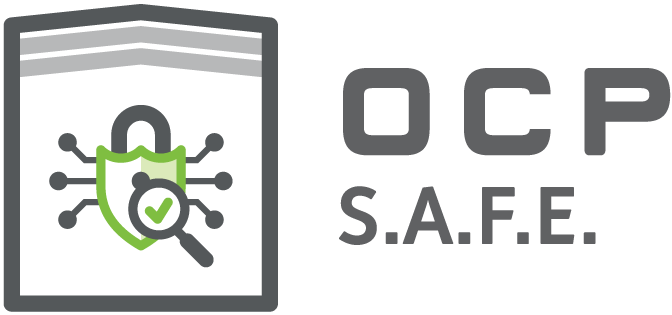

## SRP Requirements

OCP Security Workgroup

**Revision History**

<table>
  <tr>
   <td><strong>Revision</strong>
   </td>
   <td><strong>Date</strong>
   </td>
   <td><strong>Guiding Contributor(s)</strong>
   </td>
   <td><strong>Description</strong>
   </td>
  </tr>
  <tr>
   <td>1.0
   </td>
   <td>Sep, 2023
   </td>
   <td>IOA, Microsoft
   </td>
   <td>Initial draft
   </td>
  </tr>
  <tr>
   <td>
   </td>
   <td>
   </td>
   <td>
   </td>
   <td>
   </td>
  </tr>
  <tr>
   <td>
   </td>
   <td>
   </td>
   <td>
   </td>
   <td>
   </td>
  </tr>
</table>

##   

## Glossary

* CSP - Cloud Service Provider
* DV - Device Vendor
* SRP - Security Review Provider

## Executive Summary

This document gives guidelines for the selection of external SRP organizations to do security assessments of software
and firmware designs and implementations, and hardware designs, particularly for trusted applications. It defines scopes
of assessment aligned with products and industry practice, then gives the technical expertise and capabilities the SRP
organization needs to deliver quality assessments covering those scopes. There are also general organizational
requirements intended to ensure such assessments are broadly trusted. These guidelines are intended to make it easier
for DVs and CSPs to engage with SRP organizations to get quality, relevant, trusted third party assessments.

This document describes guidelines for both scope of assessments relative to device types under assessment and to the
requirements on the SRP in order to prove capability to deliver quality assessments matching the scopes defined.

Different scope levels will encompass varying device types subject to different security threats. Some scopes have
narrower requirements and correspond to relatively common device types and review scenarios, while others require
demonstrating a larger, different set of skills to deliver an assessment.

It will likely be the case that a single SOC may require analysis from multiple scopes, e.g. the security processor may
require additional scrutiny than the application cores.

There is a burden of proof on the SRP to demonstrate it meets the guidelines. The OCP will establish a panel for
assessing applications to become an approved SRP, and this document gives the basis on which the assessment will be
made. The application should include a response to the business requirements and technical requirements given below. The
response to the technical requirements should be organized around the assessment scopes. A more comprehensive list of
review areas can be found in the [review areas](review_areas.md) document.

## Assessment Scope Overview

### Scope 1 - Validating Code

#### Discussion

This scope broadly covers privileged software and firmware in the context of a single device or function. Areas of
emphasis include evaluating code quality and development practices as well as correct application of standards and
interaction with security hardware.

#### Examples

Device drivers and privileged software interacting with existing approved hardware or IP, firmware for a single endpoint
device handling only its identity and ephemeral secrets,

#### Desired Capabilities

The SRP should be prepared to offer assessment capabilities in the following areas.

1. Review of existing or preparation of new threat model
2. Review of documentation
3. Review of evidence
4. Code Review
    1. Firmware authenticity and integrity
    2. Secure boot
    3. Update mechanisms
    4. Short term secrets
    5. Credentials
    6. Cryptography
        1. Material handling
        2. Algorithms
        3. Entropy sources
    7. Input validation
    8. Backdoors
    9. Typical development errors
    10. Use of deprecated or insecure functions
    11. Memory safe programming
    12. Dependencies
    13. Erasure
    14. Exploit mitigation
5. Review of build environment
    1. Review of toolchain integrity:

    * Specified compiler, library versions

    2. Review of toolchain output

    * Use of protective technology
    * Debug strings, symbols
    * Stack canaries, protection

### Scope 2 - Assessing architecture for isolation

#### Discussion

This scope focuses on Trusted Execution Environments and trust boundaries with designs operating with the least
privilege, generally speaking in a context with multiple trust boundaries or multiple physical devices. Examples include
devices that include or heavily use root of trust and security processors for SOC management, and host capabilities such
as SGX, SEV, or Trustzone for user or application isolation and protection.

#### Examples

Accelerator hardware intended to serve multiple customer tenants simultaneously.

#### Required Capabilities

1. Trusted Execution Environment assessment
2. Handling of trust boundaries
3. Attestation and non-repudiation across boundaries
4. Physical and logical debug paths evaluation
5. RTL/ROM evaluation

### Scope 3 - Assessing system for resilience to physical attacks

#### Discussion

This scope is intended to cover devices and systems that require assessing their resilience to physical attack. Parts of
an SOC that may require this level of analysis include root of trust, security processor, logic handling long term
secrets, and crypto accelerator blocks.

#### Required Capabilities

1. Threat model evaluation vs design mitigations
    1. Demonstrated expertise with current attack techniques and costs in time and equipment
    2. Demonstrated expertise with mitigation techniques
2. Design evaluation for physical isolation
   1. Specific evaluation of software coding techniques (time, CFI)
   2. RTL evaluation (masking, clocking, toolchain capabilities, …)
   3. Physical design evaluation for isolation, die and PCB
3. Time, Frequency, Voltage, Power, Optical and EM domain side channel analysis facilities
4. Time, Voltage, Optical and EM domain fault injection facilities
5. Code flow integrity protections around boot and crypto
   1. Time constant
   2. Checking complimentary hw
   3. Integrity checked OTP fuses
6. Crypto accelerators designed to withstand glitching attacks

## Business Requirements and Code of Conduct

The criteria and questions below will be evaluated in totality. A prospective SRP does not need to address everything
listed below in granular detail. The OCP will assess each CSP application and the responses to each of the following
questions.

### Conflict of Interest

<table>
  <tr>
   <td>
<ol>

<li>The SRP must strictly adhere to responsible disclosure standards when disclosing vulnerabilities.
</li>
</ol>
   </td>
  </tr>
  <tr>
   <td>
<ol>

<li>The SRP must not sell details of vulnerabilities or exploits to entities other than the organization responsible for securing the product.
</li>
</ol>
   </td>
  </tr>
  <tr>
   <td>
<ol>

<li>SRP executives and board members must proactively disclose affiliations that may cause an appearance of conflict of interest.  For example, any affiliations with organizations that sell exploits, law enforcement, military, or intelligence organizations must be disclosed.
</li>
</ol>
   </td>
  </tr>
  <tr>
   <td>
<ol>

<li>If the SRP is trying to conduct a self-audit or vouch for works created by the SRP or an affiliated company, OCP-SAFE does not recognize this.
</li>
</ol>
   </td>
  </tr>
  <tr>
   <td>
<ol>

<li>If the SRP has any affiliations with manufacturers or companies that are applying for an OCP SAFE Audit through the same SRP, this affiliation must be disclosed.
</li>
</ol>
   </td>
  </tr>
  <tr>
   <td>
<ol>

<li>If the SRP forms affiliations with manufacturers or companies that intend to undergo an OCP SAFE Audit, this affiliation must be declared at the time it is established.  
</li>
</ol>
   </td>
  </tr>
  <tr>
   <td>
<ol>

<li>The SRP must enforce the above requirements on employees, staff and contractors 
</li>
</ol>
   </td>
  </tr>
</table>

### Information Security Policies

1. Does the SRP have an Information Security Policy (ISP) in place?
2. Does the ISP include security objectives at all business functions and levels?
3. Has the ISP been established and approved by management?
4. Has the ISP been published and communicated to all employees and relevant external parties within the supporting
   supply chain?
5. Is the ISP reviewed at planned intervals (no longer than one year), or if significant changes occur, to evaluate
   continuing suitability, adequacy and effectiveness?
6. Has a method been established to enable individuals to confirm their acceptance of and compliance with the ISP?
7. Is the ISP supported by a suite of risk specific information/cybersecurity policies, for example an Access Control
   Policy, Acceptable Use Policy, Malware Policy etc?
8. Does the organization have a named and defined role that is responsible for Information Security?
9. Do you manage Information Security and Information Technology separately?
10. Are contacts maintained with relevant authorities to help anticipate forthcoming changes in relevant laws or
    regulations?
11. Is Information Security addressed in project management regardless of the type of the project?
12. Is a high-level working group (or equivalent) assigned responsibility for managing Information Security projects?
13. Does your ISP, or a separate specific Policy, address the risks associated with remote access?
14. Does your ISP cover all devices with access to business networks, systems, or data (e.g. laptops, mobile devices)
    and all Program Participant data, regardless of IT media?

### Human Resources

1. Is there an employee pre-screening policy that includes criminal, credit, and professional / academic references as
   allowed by local law?
2. Are organizational and individual responsibilities for Information Security clearly defined in the terms and
   conditions of employment contracts and within the job specifications?
3. Are non-disclosure agreements current and in place with all staff who have access to organizational assets hosting
   customer information?
4. Is there training in place to ensure that employees and contractors receive appropriate Information Security
   awareness training and updates to organizational policies and procedures?
5. Is security awareness training incorporated as part of the induction process (within a maximum of four weeks after
   joining the organization)?
6. Are all staff required to complete an annual session of security awareness training?
7. Does the security awareness training include a testing component (e.g., to test employees' handling of emails, links,
   attachments etc.)?
8. Is security awareness training commensurate with differing levels of responsibilities and access?
9. Do employees responsible for Information Security undergo additional specific training (e.g., Information Security
   Operations)?
10. Is there a disciplinary process, that would be invoked as a consequence of non-compliance referenced, in all relevant
    policies and related training?
11. Is there a policy/documented process to ensure that HR notify security/access administration of an
    employee's/contractor's termination or change of status for access rights removal?
12. Is there a policy / documented process to ensure that all employees are aware of their continuing responsibilities
    and duties after leaving the organization?

### Management of Information Assets

1. Do you maintain registers of Program Participant relevant information, device and software assets?
2. Is ownership (an authorized and responsible manager) assigned to each information asset?
3. Is there an individual who is responsible for approving access to Program Participant data?
4. Is the Information Security policy supported by detailed acceptable use policies (AUPs) that define the way in which
   individuals are expected to use information and systems within the SRP?
5. Is there a policy/ documented process to ensure that assets (laptops, mobile phones, ID cards, user accounts,
   hardware, software, documents) are destroyed, returned or revoked upon employee termination?
6. Is there a documented procedure that ensures that all information assets are correctly classified and aligned with
   the Program Participant classification scheme?
7. Does the handling of information assets in accordance with the information classification include how assets must be;
   stored, transmitted, destroyed, encrypted?
8. Do you have a way of separating/ labeling Program Participant data from other information that you store?
9. Do you have any Data Loss Prevention (DLP) controls in place?
10. Is there a documented procedure for the secure disposal, re-purpose and / or destruction of physical media (e.g.,
    paper documents, CDs, DVDs, tapes, disk drives, etc.) in accordance with Program Participant requirements and in
    accordance with Program Participants information classification scheme? (e.g. NIST SP-800-88)
11. Do you protect Program Participant data that is transferred or transmitted?

### Access Control

1. Do you have an implemented access control policy which covers the granting and revoking of access to systems?
2. Is there a documented and implemented process to ensure access rights are reviewed on a scheduled basis and removed
   upon termination of employment?
3. Are inactive user accounts monitored, identified, removed or disabled (either through manual or automated processes)?
4. Do you review access rights on a scheduled basis using a formal process?
5. Are procedures established and maintained to prohibit the use of generic administration user accounts, according to
   the systems' configuration capabilities?
6. Is an authorisation process maintained, including a record of all privileges allocated?
7. Is there a documented procedure in place concerning the use of networks and network services relating to connections
   to sensitive and/or critical business applications?
8. Do you store and monitor audit logs of access to systems containing Program Participant data?
9. Do you operate an Onboarding Process which ensures that employees or subcontractors are only given access to systems
   based on the requirements of their role and all are issued unique login credentials?
10. Does your Onboarding process assign permissions to Joiners based on their role (rather than copying existing user
    permissions)?
11. Does your Onboarding process accommodate for employees moving into different roles within the SRP (Movers)?
12. Does your Onboarding process ensure any admin access must be gained by using an accountable escalation mechanism,
    e.g., Sudo or Windows Access control?
13. Does your Onboarding process ensure admin accounts are forced to use Multi-Factor Authentication (e.g., SMS, Authy,
    Authenticator etc.)?
14. Do you have a documented and implemented Password Policy that utilizes recognized practices as prescribed by NIST
    SP800-63B?
15. Is password reset authority restricted to authorized persons and/or an automated password reset tool?
16. Are user IDs and passwords communicated/distributed separately?
17. Is the use of privileged utility programs restricted and monitored?

### Cryptography

1. Does the SRP have an implemented policy on the use of cryptographic controls for the protection of customer
   information?
2. Are risk assessments undertaken to determine the type, strength and quality of encryption algorithms required to
   protect customer information?
3. Is customer information copied to removable media encrypted?
4. Is customer information encrypted when being transmitted across networks?
5. Does the SRP have an implemented policy that addresses the generation, storing, archival, retrieval, distribution,
   retirement and destruction of cryptographic keys?
6. Does the SRP have an implemented policy that addresses the generation, storing, archival, retrieval, distribution,
   retirement and destruction of cryptographic keys?
7. Does the implementation of the encryption policy consider the impact of using encrypted information on controls that
   rely on content inspection - e.g. malware detection?
8. Does the implementation of the encryption policy account for regulations and national restrictions that might apply
   to the use of cryptographic techniques and the issues of cross-border flow of customer encrypted information?

### Physical and Environmental Security

1. Is there a physical security program approved by management, communicated to all employees and relevant parties, and
   has an owner assigned to maintain and review?
2. Are physical security perimeters defined and used to protect areas at all locations that contain Program Participant
   information?
3. Is access to areas where Program Participant information is processed or stored logged in a physical book or an
   electronic audit trail maintained?
4. Is access to areas where Program Participant information is processed or stored controlled by appropriate access
   controls - i.e. key card, token, fob, biometric reader, etc.?
5. Are entry and exit doors alarmed (forced entry, propped open) and/or monitored by security guards for areas where
   Program Participant information is stored or processed?
6. Are all staff, contractors and visitors required to immediately report a lost or stolen access card that would
   provide access to the area where Program Participant information is processed or stored?
7. Are visitors required to produce identification, such as a driving License or Passport etc., before being granted
   access to areas where Program Participant information is stored or processed?
8. Are visitors to areas where Program Participant information is processed or stored escorted at all times?
9. Do you or your subcontractors operate procedures for logging and tracking hardware containing Program Participant
   data being taken off-site?
10. Do you operate and technically enforce a 'Clear Screen' policy requiring that computers and terminals should be left
    logged off or protected with a screen and keyboard locking mechanisms controlled by a password, token or similar
    user authentication mechanism when unattended?
11. Do you operate a clear desk policy that requires sensitive business information, on paper or electronic storage
    media, to be locked away (ideally in a safe or cabinet or other forms of security furniture) when not required,
    especially when the area is vacated?

### Operations Security

1. Do you have a documented and implemented hardening/standard build with security controls for servers, desktops, and
   VMs
2. Does the hardening/standard build ensure vendor default password(s) are changed and unneeded ports, protocols and
   services etc. are disabled?
3. Is there a change management procedure in place to cover changes to the SRP, business processes, network, hardware
   and information systems?
4. Are all changes subject to a review and approval process?
5. Do you operate a vulnerability management process that ensures the timely patching of your computers and
   applications?
6. Have you deployed anti-malware/anti-virus software that is updated regularly on all endpoints and servers?
7. Are files received via email/download scanned when they enter the network?
8. Are IT systems that host Program Participant information regularly backed up?
9. Do back-up controls ensure that the availability of Program Participant information can be sustained in line with
   Program Participant's business requirements?
10. In the case of Program Participant relevant systems and services, do backup arrangements cover all systems
    information, applications and data necessary to recover the complete system?
11. Are system administrators and operators' activities monitored and logged in a non-modifiable way?
12. Are resources monitored and projections made with customer involvement of future capacity requirements?
13. Do you have hardening standards in place to ensure vendor default password are changed and unneeded ports, protocols
    and services etc. are disabled?
14. Are your hardening standards enforced across all Program Participant relevant systems?
15. Are there controls that prevent or detect the use of known or suspected malicious websites (for example, website
    blacklisting)?
16. Are event logs of user activities, exceptions, faults and information security events produced, kept and regularly
    reviewed for Program Participant relevant systems?
17. Is access to logging information restricted to authorized personnel only?

### Communication (Network) Security

1. Has the SRP established and documented responsibilities for the management of IT networking?
2. Are controls in place to safeguard the confidentiality and integrity of the SRP's data that passes over public and
   wireless networks - e.g. encryption?
3. Have security requirements been identified and included in all outsourced network service agreements?
4. Do your internal network designs conform to the ‘defense in depth’ principle whereby the use of multiple security
   controls or security layers are deployed to mitigate the risk of one component of the network’s defense being
   compromised or circumvented?
5. Are devices and computer systems of low trust level such as remote access servers and wireless network access points
   located in dedicated network security zones?
6. Are mission-critical and highly sensitive assets located in dedicated security zones?
7. Are network and security management systems located in dedicated security zones?
8. Are systems in development and/or testing located in different zones than production systems?
9. Where applicable, are there procedures in place for the protection of electronic Program Participant information
   transmitted in the form of an email attachment?
10. Are your staff, including permanent, contract and temporary resource, advised not to discuss Program Participant
    business/information not already in the public domain in their personal social/social media interactions?

### System Acquisition, Development, & Maintenance

1. Are formal principles for the engineering of secure systems established, documented, maintained and applied?
2. Are new IT systems subject to a rigorous information security assurance process prior to 'go live'?
3. Are all IT systems that handle Program Participant information subject to a periodic (at least annual) 're-assurance'
   process?
4. Does the selection of controls consider the sensitivity of data to be processed, stored and transmitted by the system
   under development?
5. Are applications developed through a formal System Development Life Cycle (SDLC) procedure?
6. Do you supervise and monitor the activity of outsourced system development?
7. Do you provide details of an approved threat model that relates to the information that will be handled, processed,
   stored and transmitted by the system to the external developer?
8. Do your development procedures meet or exceed recognised good practices, e.g. OWASP?
9. Is the use of embedded credentials within applications prohibited?
10. Is the use of 'live' data containing personally identifiable information for testing purposes prohibited?
11. Does the SRP develop control data sets for the specific use of system testing?
12. Are your development, testing and operational environments separated?
13. Are automated tools, such as code analysis tools or vulnerability scanners employed?
14. Do you conduct application-level security penetration testing prior to deployment?
15. Are re-tests undertaken to confirm the closure of previously identified vulnerabilities?

### Supplier Relationships

1. Is an accurate record maintained of all suppliers that process or otherwise handle Program Participant data?
2. In all instances where a supplier will handle Program Participant information, are the information security
   requirements for mitigating associated risks agreed with the supplier and documented?
3. All suppliers of outsourced IT systems or services subject to a rigorous information security assurance and
   periodic 're-assurance' process?
4. Do Program Participant relevant supplier agreements include monitoring and/or other methods for validating that the
   products and services being provided remain appropriately secure?
5. Do supplier agreements require the propagation of the SRP's information security requirements throughout the
   supplier's subcontractors and suppliers?
6. Do you ensure that your suppliers are unable to extract or remove copies of Program Participant data unless
   explicitly required in the service being provided?
7. If access to Program Participant data is required by your suppliers, do you make Program Participant aware prior to
   access being granted and obtain consent?
8. When you end your relationship with a supplier, do you make sure they securely destroy or return Program Participant
   information?
9. Are service reports produced by suppliers and regular account meetings held?
10. Are your suppliers contractually obliged to provide information about Program Participant relevant information
    security incidents in a timely manner?

### Information/Cyber Security Incident Management

1. Do you operate documented processes for the monitoring, detecting, analyzing and reporting of information/cyber
   security events?
2. Are all employees, contractors, temporary resources and suppliers aware of what is described as an information/cyber
   security event?
3. Are all employees, contractors, temporary resources and suppliers aware of their responsibility to report
   information/cyber security events as quickly as possible?
4. Is the information/cyber security event reporting mechanism easily accessible and readily available?
5. Are information/cyber security events first assessed prior to being declared as incidents?
6. Are information/cyber security incidents classified and prioritized?
7. Do you have a documented Information/Cyber Security Incident Response Procedure?
8. Do the documented incident procedures require the collection of evidence as soon as possible after the occurrence?
9. Do the documented incident procedures require the conducting of information/cyber security forensic analysis?
10. Do the documented incident procedures include escalation requirements and parameters?
11. Do the documented incident procedures require all response activities and actions are logged for later analysis?
12. Do the documented incident procedures restrict the communication of information to only those with a 'need to know'?
13. Do the documented incident procedures require post-incident analysis to be undertaken to identify the 'root cause'
    of the incident?
14. Are there documented processes that details who within Program Participant must be informed of a relevant incident,
    the circumstances and when they must be informed and by what method?
15. Are there formal documented procedures for the identification, collection, acquisition and preservation of
    information that can serve as evidence in relation to an information/cyber security incident?
16. Are formal documented procedures followed when dealing with evidence for the purposes of disciplinary and legal
    action?
17. Is knowledge gained from analyzing and resolving security incidents used to reduce the likelihood or impact of
    future incidents?

### Information Security Aspects of Business Continuity Management

1. Has a Business Impact Analysis (BIA) been conducted on all Program Participant relevant systems, applications and
   platforms?
2. Has the SRP identified Program Participant's requirements for the availability of its information?
3. Are information security continuity requirements captured within the SRP's business continuity and/or disaster
   recovery processes?
4. Has the SRP ensured that personnel with the necessary responsibility, authority and competence to manage a business
   continuity impacting incident are in place?
5. Does the SRP exercise and test its BCM/DR capability on a regular basis?
6. Are the SRP's information processing facilities implemented with sufficient redundancy to meet Program Participant's
   availability requirements?
7. Have redundant architectures been implemented where availability cannot otherwise be guaranteed?
8. Are redundant architectures tested regularly?

### Compliance (Security Governance, Risk, and Compliance)

1. Does the SRP have a privacy officer or other individual responsible for providing guidance to managers, users and
   service providers on their responsibilities and specific privacy related procedures?
2. Does the SRP undertake privacy impact assessments on new IT systems/services or when a significant change or upgrade
   to an IT system/service is planned?
3. Are the SRP's IT systems regularly reviewed for compliance with the SRP's information/cyber security policies?
4. Are penetration tests regularly undertaken?
5. Are electronic vulnerability scans regularly undertaken?
6. Are effectiveness measures defined for all controls?
7. Is the SRP's approach to managing information security and its implementation independently reviewed at planned
   intervals or when significant changes occur?
8. Are the results of independent reviews recorded, reported to the management that initiated them and the records
   maintained?
9. Are actions identified to correct non-compliance with policies recorded and acceptable remediation tracked?

##   

## Technical Requirements

The criteria and questions below will be evaluated in totality. A prospective SRP does not need to address everything
listed below in granular detail. The OCP will assess each CSP application and the responses to each of the following
requirements. The requirements should be viewed as desired but not essential. The more requirements a potential
SRP can demonstrate, the stronger the case for acceptance as an approved SRP.

### Scope 1 assessments

1. Redacted real engagement reports applicable to each discipline demonstrating quality of assessment and reporting.
   Reports need to be in a format to be made public.
    1. Embedded code review in languages (list of languages)
    2. Review of documentation and evidence as outlined in Assessment Scope -> Documentation.
    3. Assessment of cryptographic systems
2. List and URL’s of documents, blog posts, white papers published by SRP
3. List of tools developed internally by SRP (IP controlled)
4. List of tools of developed and made public by SRP

### Scope 2 assessments

Where SRP wishes to perform Scope 2 assessments, Scope 1 plus;

1. The following list is relevant to the assessment of trusted execution environments, both software and hardware
   including hybrids. In addition to CPUs examples of assessments of host aware devices such as GPUs, network
   interfaces, bulk storage;
    1. Redacted real engagement reports applicable to each discipline demonstrating quality of assessment and reporting.
       Reports need to be in a format to be made public.
    2. List and URL’s of documents, blog posts, white papers published by SRP
    3. List of tools developed internally by SRP (IP controlled)
    4. List of tools of developed and made public by SRP

### Scope 3 assessments

The assessments described in this document do not require a laboratory. The assessments can be performed entirely on
design and implementation documents prior to manufacturing. However, an SRP that can perform these types of analysis
when requested is appreciated.

Where SRP wishes to perform Scope 3 assessments, Scope 2 plus;

1. Demonstration of experience and skills is required for side channel analysis covering voltage, power, time domains;
    1. Redacted real engagement reports applicable to each discipline demonstrating quality of assessment and reporting.
       Reports need to be in a format to be made public.
    2. List and URL’s of documents, blog posts, white papers published by SRP
    3. List of tools developed internally by SRP (IP controlled)
    4. List of tools of developed and made public by SRP
2. Optional: Laboratory, facilities and equipment to support side channel and fault injection attacks;
    1. Electronic debug interface exercising and discovery tools (HW and SW)
    2. Fault injection equipment
    3. Time, voltage, power domain side channel measurement and analysis equipment relevant to the devices in this scope
    4. Silicon assessment tools such as
